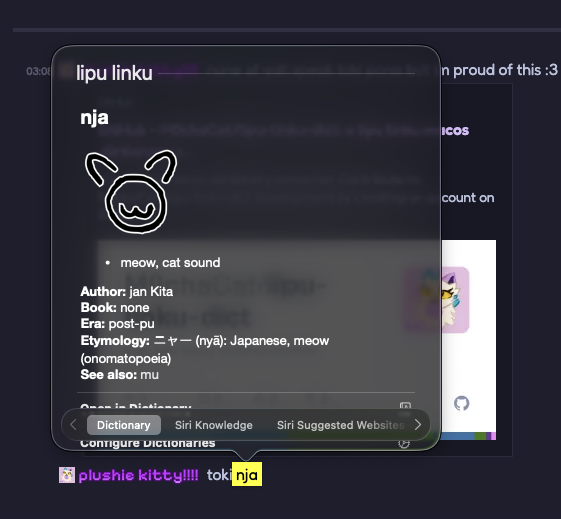

# lipu linku .dictionary converting doodad!!!

  

if u hav any issues just dm me on discord `@communistkittycat`!!!!!

## how to install

- go to [releases page](https://github.com/M0chaCat/lipu-linku-dict/releases/)
- download `lipu-linku.dictionary.zip`
- unzip it
- copy the .dictionary file (might show as a folder!!) to `~/Library/Dictionaries/` (the ~ means your user folder, like /Users/Mocha/)
- open the dictionary app
- open its settings from the menu bar
- scroll (or search) for the new one named `lipu linku` and enable it and move it to the tippy top!!
- tada!!! :3

## how to build manually

- install da python packages: `pip3 install GitPython`
- download and convert from linku stuff: `python3 ./convert.py`
- build: `make`
- copy it: the .dictionary is in /lipu-linku-dict/objects/, so now start at step 4 of installing it! :3
